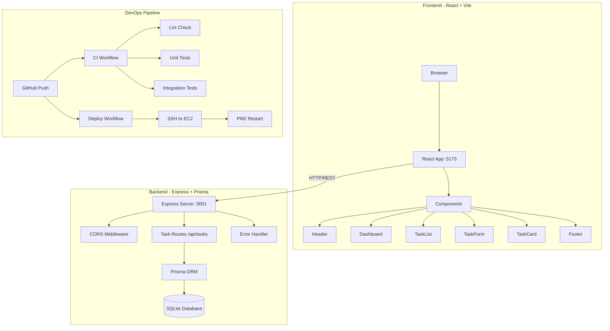

# TaskFlow - Smart Task Manager 🚀

A full-stack task management SaaS tool built with **React**, **Express**, **Prisma**, and **SQLite** — featuring complete DevOps infrastructure including CI/CD, automated testing, linting, and AWS EC2 deployment.

---

## 🏗️ Architecture



## ✨ Features

- **Full CRUD API** — Create, Read, Update, Delete tasks with validation
- **Filtering & Sorting** — Filter by status, priority; sort by date
- **Modern UI** — Glassmorphism, gradient accents, micro-animations
- **Responsive Design** — Works on mobile, tablet, and desktop
- **Dashboard Analytics** — Visual stats for task statuses

## 🛠️ Tech Stack

| Layer          | Technology                       |
| -------------- | -------------------------------- |
| Frontend       | React 18, Vite, Axios            |
| Backend        | Express.js, Node.js              |
| Database       | SQLite (via Prisma ORM)          |
| Unit Tests     | Jest (server), Vitest (client)   |
| Integration    | Supertest + Prisma               |
| E2E Tests      | Playwright                       |
| Linting        | ESLint, Prettier                 |
| CI/CD          | GitHub Actions                   |
| Deployment     | AWS EC2, PM2, Docker             |
| Dep Management | Dependabot                       |

## 📂 Project Structure

```
├── .github/
│   ├── workflows/
│   │   ├── ci.yml              # CI pipeline (test + lint)
│   │   ├── pr-checks.yml       # PR lint enforcement
│   │   └── deploy.yml          # EC2 deployment
│   └── dependabot.yml          # Dependency updates
├── client/                     # React frontend
│   ├── src/components/         # React components
│   ├── tests/                  # Unit tests (Vitest)
│   ├── e2e/                    # E2E tests (Playwright)
│   └── vite.config.js
├── server/                     # Express backend
│   ├── prisma/schema.prisma    # Database schema
│   ├── src/routes/tasks.js     # CRUD API
│   ├── tests/unit/             # Unit tests
│   ├── tests/integration/      # Integration tests
│   └── Dockerfile
├── scripts/
│   ├── setup.sh                # Idempotent setup
│   ├── deploy.sh               # Idempotent deploy
│   └── bootstrap-ec2.sh        # EC2 bootstrap
└── README.md
```

## 🚀 Getting Started

### Prerequisites
- Node.js 18+ and npm

### Setup
```bash
# Clone the repo
git clone <your-repo-url>
cd devops_project

# Run idempotent setup script
chmod +x scripts/setup.sh
bash scripts/setup.sh
```

### Development
```bash
# Start backend (port 3001)
cd server && npm run dev

# Start frontend (port 5173) - in another terminal  
cd client && npm run dev
```

Open [http://localhost:5173](http://localhost:5173) to view the app.

### API Endpoints

| Method | Endpoint         | Description        |
| ------ | ---------------- | ------------------ |
| GET    | /api/tasks       | Get all tasks      |
| GET    | /api/tasks/:id   | Get task by ID     |
| POST   | /api/tasks       | Create a task      |
| PUT    | /api/tasks/:id   | Update a task      |
| DELETE | /api/tasks/:id   | Delete a task      |
| GET    | /api/health      | Health check       |

**Query Parameters:** `?status=pending&priority=high&sort=oldest`

## 🧪 Testing

```bash
# Server unit tests
cd server && npm run test:unit

# Server integration tests  
cd server && npm run test:integration

# Client unit tests
cd client && npm test

# E2E tests (requires app running)
cd client && npm run test:e2e
```

## 🔧 CI/CD Pipeline

### GitHub Actions Workflows

1. **CI Pipeline** (`ci.yml`) — Runs on push/PR to main
   - Installs dependencies
   - Runs ESLint + Prettier checks
   - Executes unit & integration tests
   - Uses Node.js version matrix (18, 20)

2. **PR Checks** (`pr-checks.yml`) — Runs on pull requests
   - Enforces code quality via linting
   - Blocks merge if formatting is wrong

3. **Deploy** (`deploy.yml`) — Runs on push to main
   - SSH into EC2 instance
   - Pulls latest code, installs deps
   - Restarts server via PM2

### Dependabot
- Checks npm dependencies weekly
- Checks GitHub Actions monthly
- Auto-creates PRs for updates

## 🐳 Docker

```bash
cd server
docker build -t taskflow-server .
docker run -p 3001:3001 taskflow-server
```

## ☁️ AWS EC2 Deployment

### Setup GitHub Secrets
```
EC2_HOST     → Your EC2 public IP
EC2_USER     → ubuntu (or ec2-user)
EC2_SSH_KEY  → Your private SSH key
```

### Scripts (All Idempotent)
- `scripts/bootstrap-ec2.sh` — First-time EC2 setup (Node, PM2, swap)
- `scripts/deploy.sh` — Pull, install, build, restart
- `scripts/setup.sh` — Local development setup

## 📐 Design Decisions

1. **SQLite + Prisma** — Lightweight, zero-config database perfect for SaaS demo; Prisma provides type-safe ORM
2. **Vite** — Faster dev server and builds compared to CRA
3. **PM2** — Production process manager with auto-restart and log management
4. **Idempotent Scripts** — All scripts use `mkdir -p`, `command -v`, conditionals — safe to run repeatedly
5. **Node Version Matrix** — CI tests against Node 18 and 20 for compatibility
6. **Glassmorphism UI** — Modern, premium design with gradient accents and micro-animations

## 🧩 Challenges & Solutions

| Challenge                          | Solution                                        |
| ---------------------------------- | ----------------------------------------------- |
| CORS between frontend and backend  | Configured proxy in Vite dev + cors middleware   |
| Database in CI environment         | Used SQLite file-based DB with Prisma db push    |
| EC2 memory limits on t2.micro      | Added swap space in bootstrap script             |
| Idempotent deployments             | Used conditional checks and PM2 process manager  |
| Test isolation                     | Separate test database with force-reset          |

## 📜 License

MIT License — built for educational purposes.
